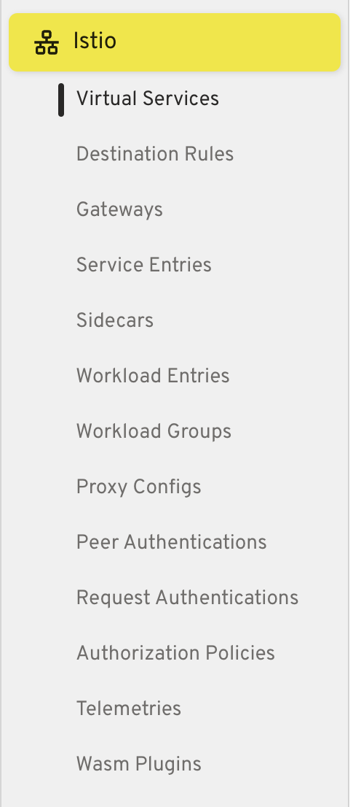

# Headlamp Istio Plugin

A [Headlamp](https://headlamp.dev/) plugin for viewing and managing [Istio](https://istio.io/) service mesh resources.

## Screenshots

### Sidebar Navigation

All Istio resources organized under a single sidebar entry.



### Virtual Service List

List view with hosts, gateways, route summary, and a create button.


### Virtual Service Detail

Detail view with spec overview, HTTP/TLS/TCP route tables, match conditions, destinations, and fault injection.


### Resource Creation

YAML editor with a pre-filled template for creating new Istio resources.


## Features

- Sidebar navigation with all Istio resource types
- List and detail views for 13 Istio CRDs
- Create resources directly from the list view via YAML editor
- Enhanced Virtual Service views with spec-level fields (hosts, gateways, HTTP/TLS/TCP routes, match conditions, destinations, fault injection, and more)
- Extensible architecture — easy to add custom views for other resource types

### Supported Resources

| Category | Resources |
|----------|-----------|
| Networking | Virtual Service, Destination Rule, Gateway, Service Entry, Sidecar, Workload Entry, Workload Group, Proxy Config |
| Security | Peer Authentication, Request Authentication, Authorization Policy |
| Telemetry | Telemetry |
| Extensions | Wasm Plugin |

## Installation

### Plugin Catalog (Artifact Hub)

1. Open Headlamp and go to **Settings > Plugin Catalog**
2. Search for **Istio**
3. Click **Install**

### Manual

```bash
git clone https://github.com/krzkowalczyk/headlamp-istio-plugin.git
cd headlamp-istio-plugin
npm install
npm run build
npm run package
```

Extract the generated `headlamp-k8s-istio-*.tar.gz` into your Headlamp plugins directory:

| Platform | Path |
|----------|------|
| Linux | `~/.config/Headlamp/plugins/` |
| macOS | `~/Library/Application Support/Headlamp/plugins/` |

## Development

```bash
npm install       # Install dependencies
npm run start     # Start dev server (with Headlamp desktop running)
npm run build     # Production build
npm run tsc       # Type check
npm run lint      # Lint
npm run test      # Run tests
```

## Releasing

Requires [GitHub CLI](https://cli.github.com/) (`gh`) authenticated.

```bash
./release.sh 0.2.0
```

The script bumps the version in `package.json` and `artifacthub-pkg.yml`, builds, packages, computes the checksum, commits, tags, pushes, and creates a GitHub Release with the tarball attached.

## Trademark Notice

Istio is a trademark of the Istio Authors. This project is not endorsed by or affiliated with the Istio project. The Istio logo and name are used for identification purposes only.

## License

[Apache 2.0](LICENSE)
